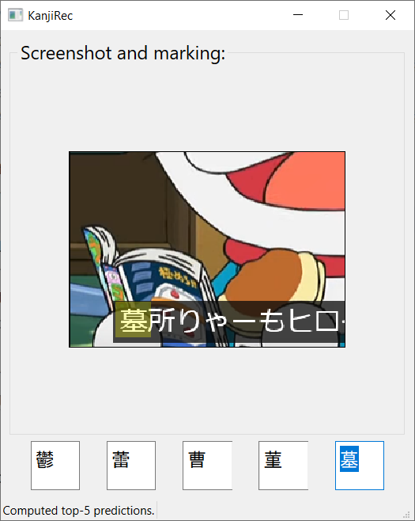

# KanjiRec

A simple CNN-based model for recognizing Japanese kanji characters in screenshots.  

## Details

The project consists of:
- `cnn_training`: test data generation and training of CNN models in `Keras`
- `KanjiRec`: a simple PyQt-based app for testing predictions.

It contains functionality to recognize kanji characters from 30x30 grayscale images.  
Currently, only Jouyou kanji characters are recognized. Although small networks are used, the prediction quality is quite good, making the tool useful for videos and online manga.

## cnn_training

### Test Case Generation

It includes scripts for generating test cases (see/execute `create_training.py`). For each Jouyou kanji, a directory is created within `training_data`, containing small grayscale images of kanji characters rendered with different fonts (see `training_data/fonts`; here you can/should add more fonts to create more test instances). Some data augmentation techniques are applied (scaling, translation, Gaussian blur, etc.).

### Training

After generating the test cases, a CNN model can be selected and trained on the test case set using `Keras`.  
The test case generation process can be found/executed in `do_train.py`. Several models are already defined. After training five batches, the model is saved in the `models` directory.

## KanjiRec

The app uses `PyQt` and `Keras`:
- Capture a screenshot
- The screenshot is displayed in the app
- Select a kanji using the mouse
- Top-5 predictions are computed and displayed

Just run `app.py` to start it. Might take some time for keras to load.

**Note**: Try to capture a tight frame around the kanji, as broader selections may reduce prediction accuracy.

## TODOs
- Extend recognition to multiple kanji characters
- Recognize all kanji characters, hiragana, and katakana
- Improve recognition accuracy
